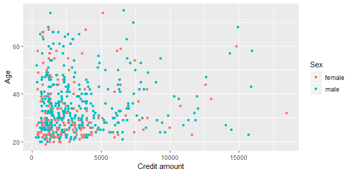
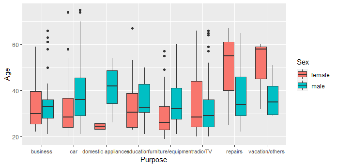
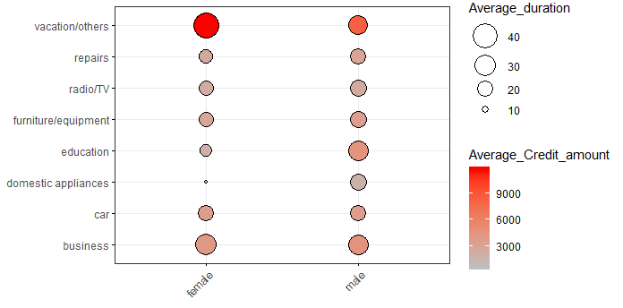

# German-Credit-Risk-Data
The original dataset contains 1000 entries with 20 categorial/symbolic attributes prepared by Prof. Hofmann. In this dataset, each entry represents a person who takes a credit by a bank. Each person is classified as good or bad credit risks according to the set of attributes.
The selected attributes are:

Age (numeric)
Sex (text: male, female)
Job (numeric: 0 - unskilled and non-resident, 1 - unskilled and resident, 2 - skilled, 3 - highly skilled)
Housing (text: own, rent, or free)
Saving accounts (text - little, moderate, quite rich, rich)
Checking account (numeric, in DM - Deutsch Mark)
Credit amount (numeric, in DM)
Duration (numeric, in month)
Purpose(text: car, furniture/equipment, radio/TV, domestic appliances, repairs, education, business, vacation/others
Risk (Value target -


```{r}
library(tidyr)
library(tidyverse)
library(ggpubr)
library(corrplot)
library(randomForest)
library(cluster)
library(fpc)
```
```{r}
ggplot(data=data)+aes(x=Age)+geom_histogram(bins=45,fill="#6baed6")+
  labs(x="Age",y="Count")+
  theme_gray()
```


```{r}
ggplot(data=data)+aes(x=Purpose)+geom_bar(fill="#6baed6")+
  labs(x="Purpose",y="Count")+
  theme_gray()+
  theme(axis.text.x=element_text(size=rel(0.9)))
```

```{r}
ggplot(data=data,aes(x=Credit.amount,y=Age,col=Sex))+geom_point()+
  labs(y="Age",x="Credit amount")+
  theme_gray()
```
  

```{r}
ggplot(data=data)+
  aes(x=Purpose,y=Age,fill=Sex)+
  geom_boxplot()+
  theme_grey()+
  theme(axis.text.x=element_text(size=rel(0.9)))
```
  

```{r}
st1<-data%>%
  group_by(Purpose,Sex)%>%
  summarise(Average_Credit_amount=mean(Credit.amount),
            Average_duration=mean(Duration))
ggballoonplot(st1, x = "Sex", y = "Purpose", size = "Average_duration",fill = "Average_Credit_amount",
              ggtheme = theme_bw()) +gradient_fill(c("Grey", "Red"))
```
  
```{r}
cor_data<-data%>%
  select(Age,Job,Credit.amount,Duration)
##
sex_male<-ifelse(data$Sex=="male",1,0)
sex_female<-ifelse(data$Sex=="female",1,0)

housing_free<-ifelse(data$Housing=="free",1,0)
housing_own<-ifelse(data$Housing=="own",1,0)
housing_rent<-ifelse(data$Housing=="rent",1,0)

Checking.account_little<-ifelse(data$Checking.account=="little",1,0)
Checking.account_moderate<-ifelse(data$Checking.account=="moderate",1,0)
Checking.account_rich<-ifelse(data$Checking.account=="rich",1,0)

Saving.accounts_little<-ifelse(data$Saving.accounts=="little",1,0)
Saving.accounts_moderate<-ifelse(data$Saving.accounts=="moderate",1,0)
Saving.accounts_quite_rich<-ifelse(data$Saving.accounts=="quite rich",1,0)
Saving.accounts_rich<-ifelse(data$Saving.accounts=="rich",1,0)

Purpose_business_business<-ifelse(data$Purpose=="business",1,0)
Purpose_business_car<-ifelse(data$Purpose=="car",1,0)
Purpose_business_domestic_appliances<-ifelse(data$Purpose=="domestic appliances",1,0)
Purpose_business_education<-ifelse(data$Purpose=="education",1,0)
Purpose_business_furniture_equipment<-ifelse(data$Purpose=="furniture/equipment",1,0)
Purpose_business_radio_TV<-ifelse(data$Purpose=="radio/TV",1,0)
Purpose_business_repairs<-ifelse(data$Purpose=="repairs",1,0)
Purpose_business_vacation_others<-ifelse(data$Purpose=="vacation/others",1,0)

cor_data<-cbind(cor_data,
                sex_male,sex_female,
                housing_free,
                housing_own,
                housing_rent,
                Checking.account_little,
                Checking.account_moderate,
                Checking.account_rich,
                Saving.accounts_little,
                Saving.accounts_moderate,
                Saving.accounts_quite_rich,
                Saving.accounts_rich,
                Purpose_business_business,
                Purpose_business_car,
                Purpose_business_domestic_appliances,
                Purpose_business_education,
                Purpose_business_furniture_equipment,
                Purpose_business_radio_TV,
                Purpose_business_repairs,
                Purpose_business_vacation_others)
##


corrplot(cor(cor_data),method = "color",addCoef.col="black",number.cex= 0.5,tl.cex = 0.5,type = "upper")

```
  


