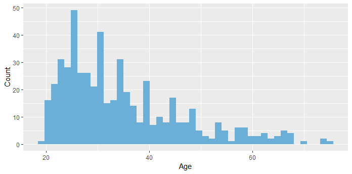
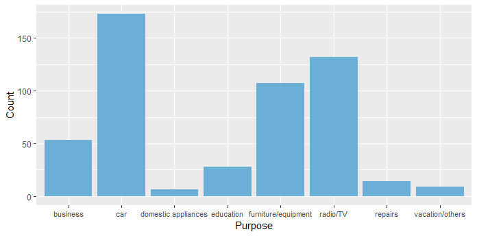
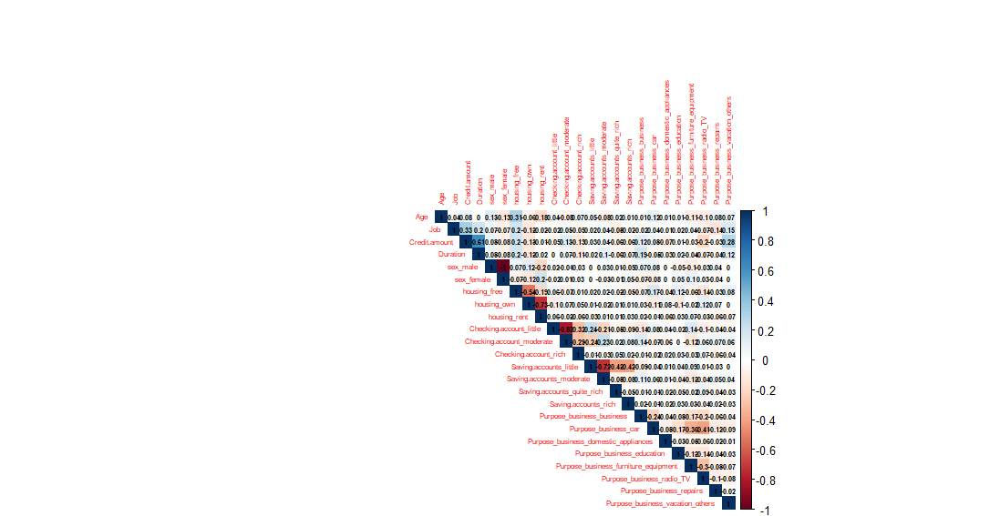

# German-Credit-Risk-Data
The original dataset contains 1000 entries with 20 categorial/symbolic attributes prepared by Prof. Hofmann. In this dataset, each entry represents a person who takes a credit by a bank. Each person is classified as good or bad credit risks according to the set of attributes.
The selected attributes are:

Age (numeric)
Sex (text: male, female)
Job (numeric: 0 - unskilled and non-resident, 1 - unskilled and resident, 2 - skilled, 3 - highly skilled)
Housing (text: own, rent, or free)
Saving accounts (text - little, moderate, quite rich, rich)
Checking account (numeric, in DM - Deutsch Mark)
Credit amount (numeric, in DM)
Duration (numeric, in month)
Purpose(text: car, furniture/equipment, radio/TV, domestic appliances, repairs, education, business, vacation/others
Risk (Value target -


```{r}
library(tidyr)
library(tidyverse)
library(ggpubr)
library(corrplot)
library(randomForest)
library(cluster)
library(fpc)
```
```{r}
ggplot(data=data)+aes(x=Age)+geom_histogram(bins=45,fill="#6baed6")+
  labs(x="Age",y="Count")+
  theme_gray()
```



```{r}
ggplot(data=data)+aes(x=Purpose)+geom_bar(fill="#6baed6")+
  labs(x="Purpose",y="Count")+
  theme_gray()+
  theme(axis.text.x=element_text(size=rel(0.9)))
```

```{r}
ggplot(data=data,aes(x=Credit.amount,y=Age,col=Sex))+geom_point()+
  labs(y="Age",x="Credit amount")+
  theme_gray()
```
  

```{r}
ggplot(data=data)+
  aes(x=Purpose,y=Age,fill=Sex)+
  geom_boxplot()+
  theme_grey()+
  theme(axis.text.x=element_text(size=rel(0.9)))
```
  


